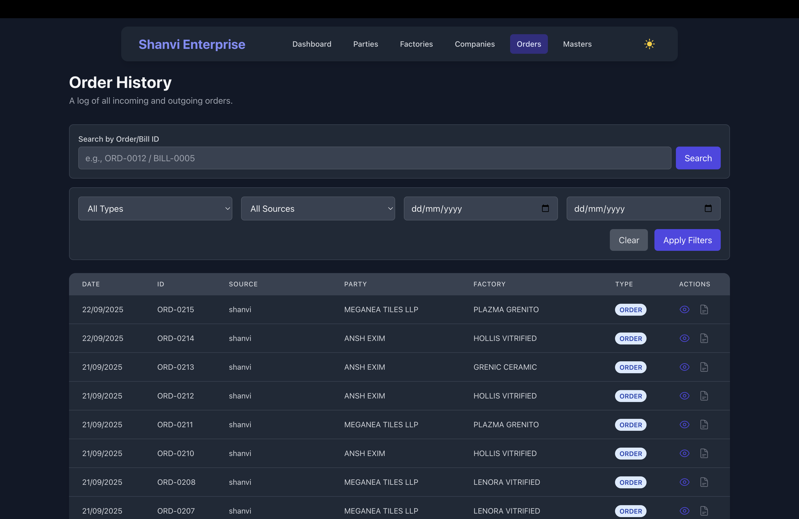
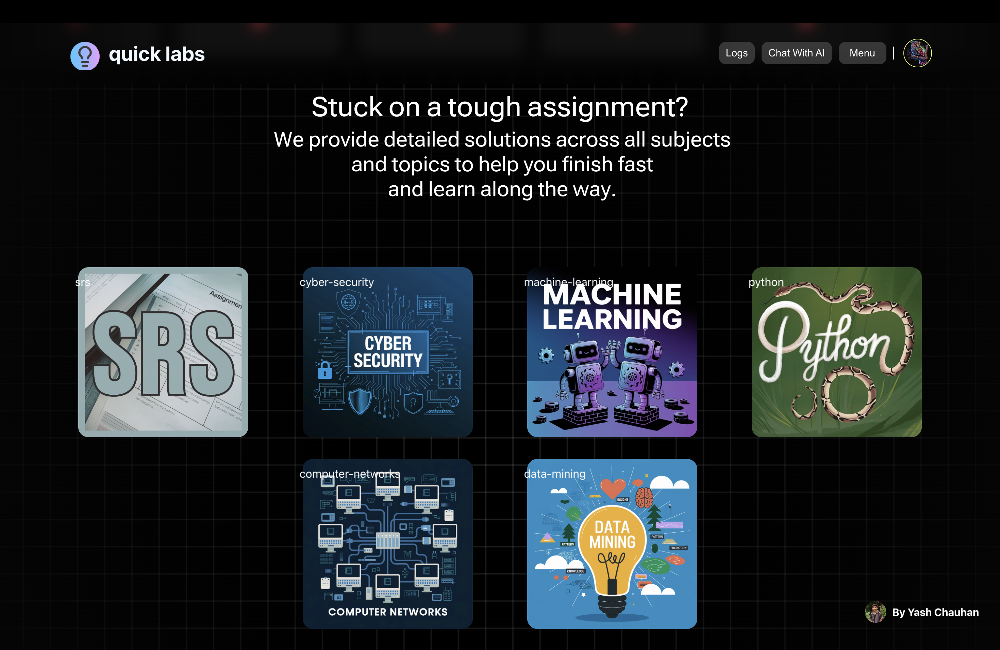

**‼ warning : If you can't own it, don't steal it. Stay original or stay away.‼**

# 👋 Hello, I'm Yash Chauhan!

### Passionate Web Developer | UI/UX Enthusiast | Open Source Contributor
**`yashchauhan1775@gmail.com`**

---

  

---

### About Me

- 👨‍💻 pursuing B.Tech( CSE ) **from @Darshan_university**.
- 🌱 Currently learning **next.js , UI design**

---

### Skills

- **Languages:** HTML , CSS , JS , Java , C , Dart  
- **Frameworks:** React , Angular , DotNet  
- **Extras:** GSAP , Framer Motion , Three.js  
- **Tools:** VS Code , Spline , Chrome , Blender , Notion , Arduino IDE  

---

## 🚀 Featured Projects

Here are some of the key projects I've worked on that showcase my skills and experience.

---

### 1. Elev8Labs - Creative Agency Portfolio

> A stunning, fully responsive portfolio website for **Elev8Labs**, a freelance creative agency client. The project features a high-level, custom UI built from scratch with Tailwind CSS, focusing on smooth animations and a pixel-perfect user experience.

| Tech Stack | `React` `Tailwind CSS` `Framer Motion` `Vite` |
| :--- | :--- |
| **Links** | [**Repository**](https://github.com/Yashchauhan008/elev8labs) • [**Live Demo**](https://elev8labs.in) |

---

### 2. Shanvi Enterprise - Inventory Management System

> An enterprise-level Inventory Management System built for a freelance client, currently managing over **₹4 Crore** in assets. This full-stack MERN application features role-based access control, real-time data tracking, and is deployed on a live Hostinger VPS.

| Tech Stack | `React` `Node.js` `Express` `MongoDB` `JWT` `Material-UI` `VPS` |
| :--- | :--- |
| **Links** | [**Repository**](https://github.com/Yashchauhan008/shanvi) • [**Live Demo**](https://shanvi001.vercel.app/) |

---

### 3. StudyBuddy / QuickLabs

> An internal university platform designed to provide students with easy access to lab manuals, assignment solutions, and study materials. This project simplifies academic life for students at Darshan University.

| Tech Stack | `React` `Node.js` `Express` `MongoDB` `Tailwind CSS` |
| :--- | :--- |
| **Links** | [**Repository**](https://github.com/Yashchauhan008/studybuddy-v2) • [**Live Demo**](https://studybuddy-v2.vercel.app/) |

---

  

---

### Let's Connect

- 📫 How to reach me: **yashchauhan1775@gmail.com**

---
